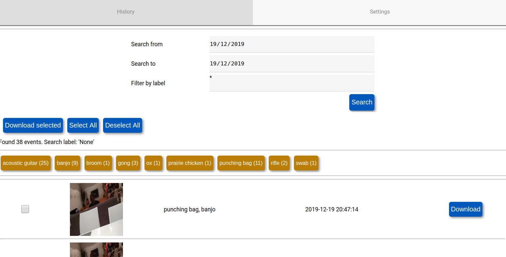
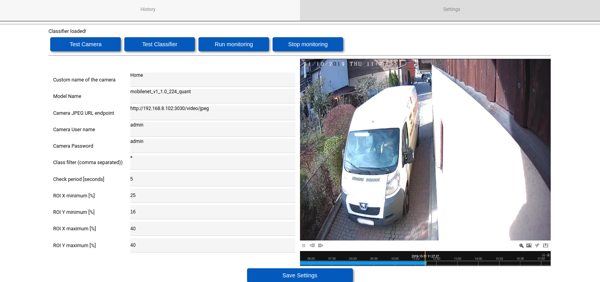

# clever-camera

A simple security camera which uses deep learning model to predict the 
content of the image and trigger snapshot for specified labels. 

## Features:

* easy to use with any deep learning framework
* snapshot history, filtering, search and zip download
* camera controls: capture frequency, ROI. It should be easy to add multiple cameras.
* Pure python, web server is based on [remigui](https://github.com/dddomodossola/remi) library


# Screenshots





# Installation and running camera server on Ubuntu/Linux (http://localhost:4000/)
```
create env conda/virtualenv...
source your_environment
pip install https://dl.google.com/coral/python/tflite_runtime-1.14.0-cp36-cp36m-linux_x86_64.whl
pip install -r requirements.txt
python app/app.py
```

# Installation and running camera server on Raspberry Pi (http://raspberrypi.local:4000/)

In the project location run following commands:

```bash
python3 -m pip install --user virtualenv
virtualenv venv
source venv/bin/activate
pip3.7 install https://dl.google.com/coral/python/tflite_runtime-1.14.0-cp37-cp37m-linux_armv7l.whl
pip3.7 install -r requirements.txt
python3.7 app/app.py
```


