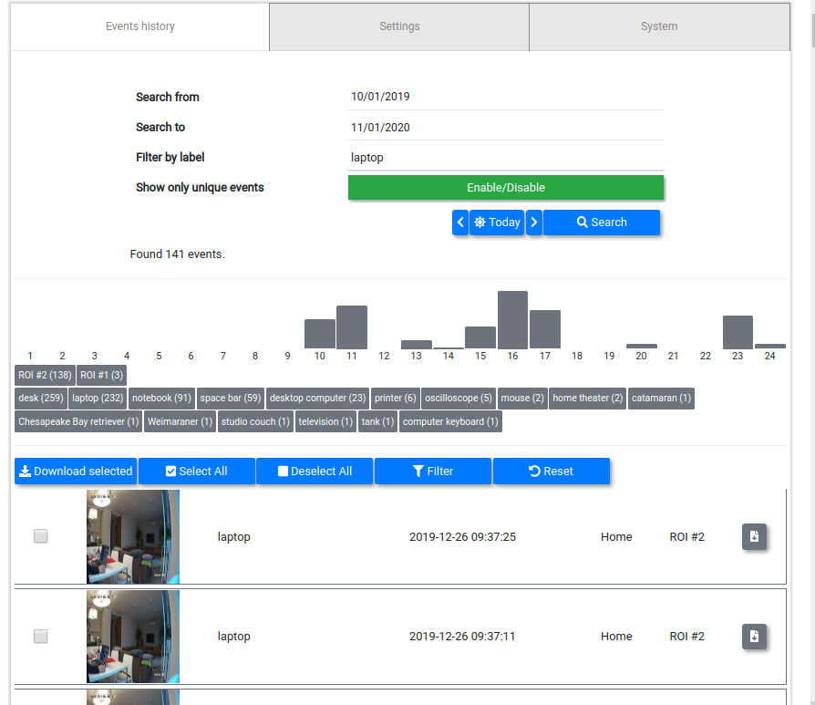
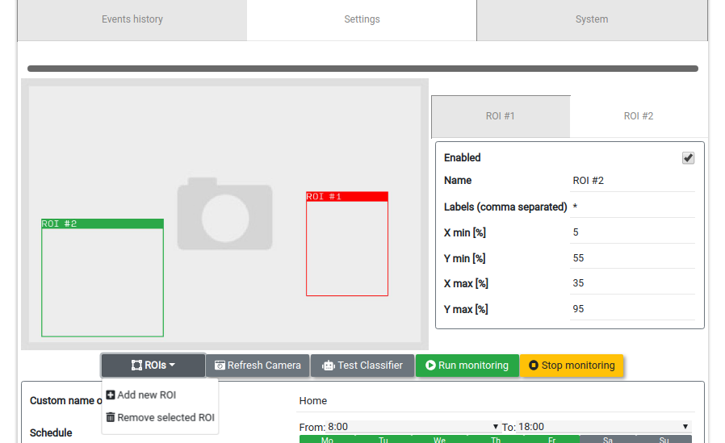
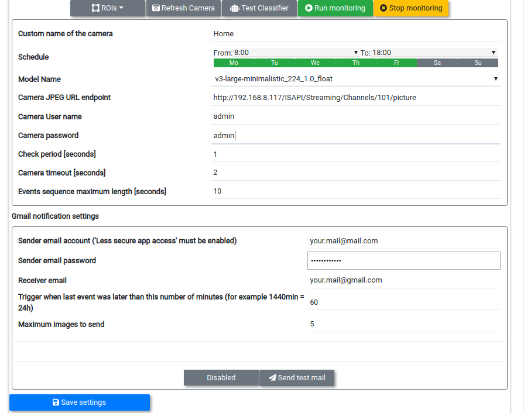
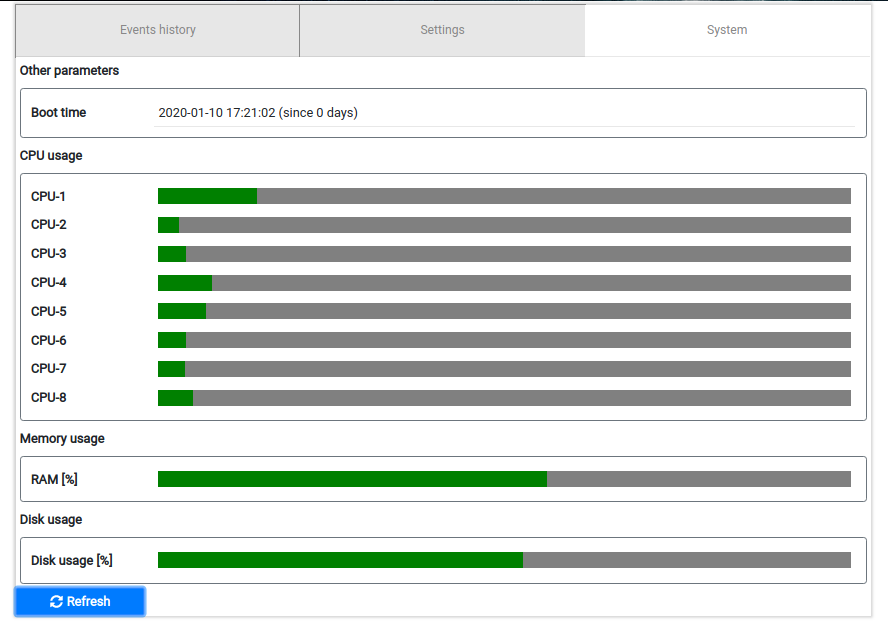

# clever-camera

A simple monitoring camera web server which uses deep learning model 
(classification) to filter or group camera events. 

# Basic workflow

    1. Setup IP camera credentials, then click "Refresh camera" to check connection.
    2. Select model from the Model name list, then click "Test classifier" to check predictions
    3. Select one or more ROIs
    4. Run/Stop monitoring. Monitoring loop will execute following steps:
       a) Get camera image
       b) Compare the pixels for possible change inside defined ROIs (naive motion detection)
       c) If no changes detected then wait "Check period" and goto a)
       d) Otherwise, trigger classifier for image fragments inside ROIs and get predicted "labels"
       e) If classifer returned labels which match the "ROI Labels" save snaphot on disk
       f) Goto a)  

# Features

## History view

 * Search by date and by label
 * Filter by hour of event
 * Filter by label name
 * Download selected as zip
 * Download single image

## Camera definition view

 * Add or Remove Region of interest (ROI)
 * Select between different MobileNets


 * Define camera client: User with Password
 * Define monitoring week-days and from-to hours
 * Define how often pictures are taken
 * Define email notifications 
 
## Resources view

 * Monitor system RAM and disk usage

# Installation
## Installation and running camera server on Ubuntu/Linux
```
create env conda/virtualenv...
source your_environment
pip install https://dl.google.com/coral/python/tflite_runtime-1.14.0-cp36-cp36m-linux_x86_64.whl
pip install -r requirements.txt

# Run 
python app/app.py
# Run with login required (more safe)
bash run.sh
```

## Installation and running camera server on Raspberry Pi 

In the project location run following commands:

```bash
python3 -m pip install --user virtualenv
virtualenv venv
source venv/bin/activate
pip3.7 install https://dl.google.com/coral/python/tflite_runtime-1.14.0-cp37-cp37m-linux_armv7l.whl
pip3.7 install -r requirements.txt
python3.7 app/app.py
```

# Limitations and project assumptions:

* This application was build to work with single user.
* Only single camera is supported, however adding more should be very easy in practice.   
* Classification is based on MobileNets models family in the tflite format. Using pytorch 
    or other frameworks is possible. One must implement custom `core.base_predictor.ClassifierPredictor` 
    and replace it in the `core.camera_widget.CameraWidget` class.
* Pure python: web server is based on [remigui](https://github.com/dddomodossola/remi) library.


